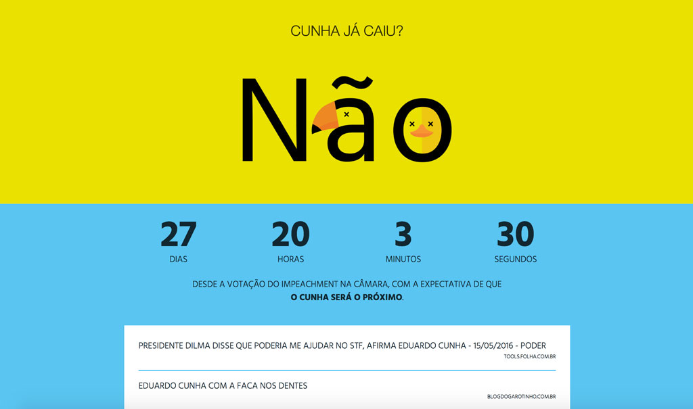

# Cunha já caiu?

[](https://travis-ci.org/cuducos/cunhajacaiu)
[](https://coveralls.io/github/cuducos/cunhajacaiu?branch=master)
[](https://codeclimate.com/github/cuducos/cunhajacaiu)

Brazilian website counting the days to the fall of [Cunha](https://pt.wikipedia.org/wiki/Eduardo_Cunha): [www.cunhajacaiu.com.br](http://www.cunhajacaiu.com.br)


 
## Install

Make sure you are working in an environment with:

* [Python](http://python.org) 3 with `pip`
* [NodeJS](http://nodejs.org) with `npm`

### Dependencies

Install the dependencies:

```console
$ pip install -r requirements.txt
$ npm i
```

### Environmental variables

Set up your environmental variables (copy `.env.sample` as `.env` for example). Optionally you can add:

#### App settings

* `FALLEN` (_default_: `False`) whether Cunha has fallen or not
* `VOTING` (_default_: `2016-04-17T23:37:00-03:00`) when we were told he's gonna be the next to fall (date and time formatted according to ISO 8601)
* `ELM_MAKE_BIN`: (_default_: `elm-make`) path to the `elm-make` binary from [Elm](http://elm-lang.org)
  (installed via `npm` by default)
* `UGLIFYJS_BIN`: (_default_: `uglifyjs`) path to the `uglifyjs` binary from [UglifyJS2](https://github.com/mishoo/UglifyJS2)
  (installed via `npm` by default)

#### Third party services

* `GOOGLE_ANALYTICS`: Google Analytics tracking code ID (e.g. `UA-XXXXXX-XX`)

### Ready, set, go

Following [Flask's new CLI](http://flask.pocoo.org/docs/0.11/cli/) set the `FLASK_APP` environment variable to the entrypoint of the app and you're good to go:

```console
$ export FLASK_APP=cunhajacaiu/__init__.py
$ flask run --reload
```

You can configure your [virtualenv](http://virtualenv.readthedocs.io) to automatically export and unset `FLASK_APP` upon activation and deactivation. With your virtualenv activated:

```console
$ ./bin/flask_app
```

## Test, develop and contribute

_Pull Requests_ are always welcomed.

Running tests requires [Nose](https://nose.readthedocs.io/) and [elm-test](https://github.com/elm-community/elm-test) (but at this point they are already installed for you).


```console
$ nosetests
$ npm test
```

## License

Copyright (c) 2016 Eduardo Cuducos.

Licensed under the [MIT license](LICENSE).
